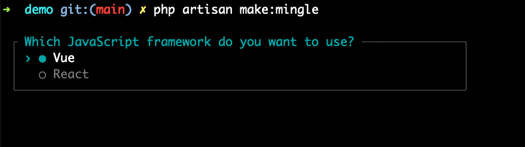
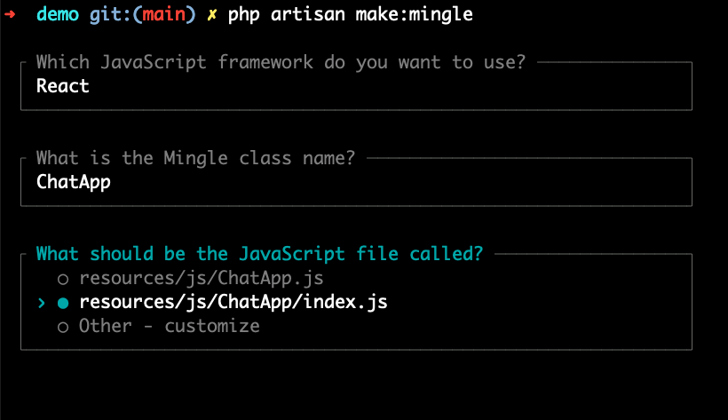

# Creating Mingles


To create a Mingle, run:

```bash
php artisan make:mingle
```




You will be interactively asked about the details of the Mingle you want to create.




## Avoiding interactive questions

To avoid the interactive questions, you can pass the options directly:

```bash
php artisan make:mingle react ChatApp --jsfile=resources/js/Foo.js
```

To understand what's going on, refer to [Anatomy of a Mingle](anatomy-of-a-mingle.md)
