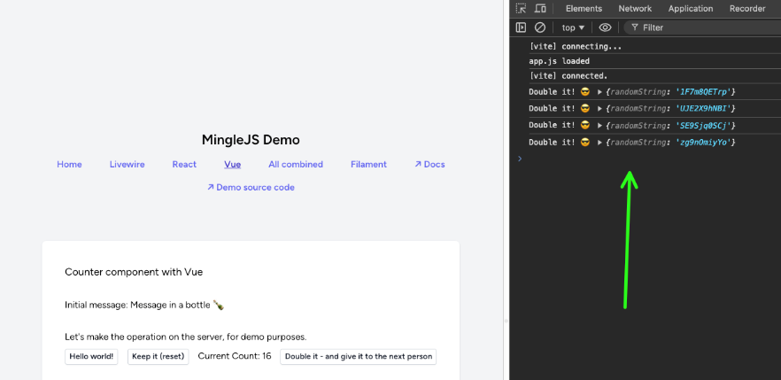
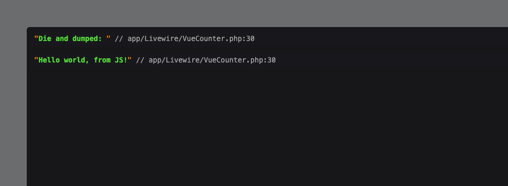

# Events and Backend

On both React/Vue, we can use the `wire` to register event listeners, that will be called owhen a backend or LW/Alpine event is emmited.

## Listening to backend, in the JS component

When the user clicks on the "Double it" button, the `doubleIt` method will be called on the backend. It will also trigger the `doubleIt` event on the LW/Alpine side. We can then listen to it and react on the JS component side.

The JS component will be notified when the event is triggered, and we can then do whatever we want with it. In this case, we will just output to console the random string generated server-side.

```php
    // VueCounter.php
    // ...
    
    public function doubleIt($amount)
    {
        $this->dispatch('doubleIt', randomString: Str::random(10));

        return $amount * 2;
    }

    // ...
```

```js
// Counter.vue

// ...

props.wire.on('doubleIt', (randomString) => {
    console.log('Double it! 😎', randomString)
})

// ...
```




## Emitting to the backend in the JS component

We can also emit events from the JS component to the backend. In this case, we will emit the `dumpMessage` event, and pass the `message` as a parameter.


```js
// Counter.vue

// ...

props.wire.$dispatch('dumpMessage', { message: 'Hello world, from JS!' })

// ...
```

```php
// VueCounter.php
// ...

    #[On('dumpMessage')]
    public function dieDump($message = null)
    {
        dd('Die and dumped: ', $message);
    }

// ...
```



