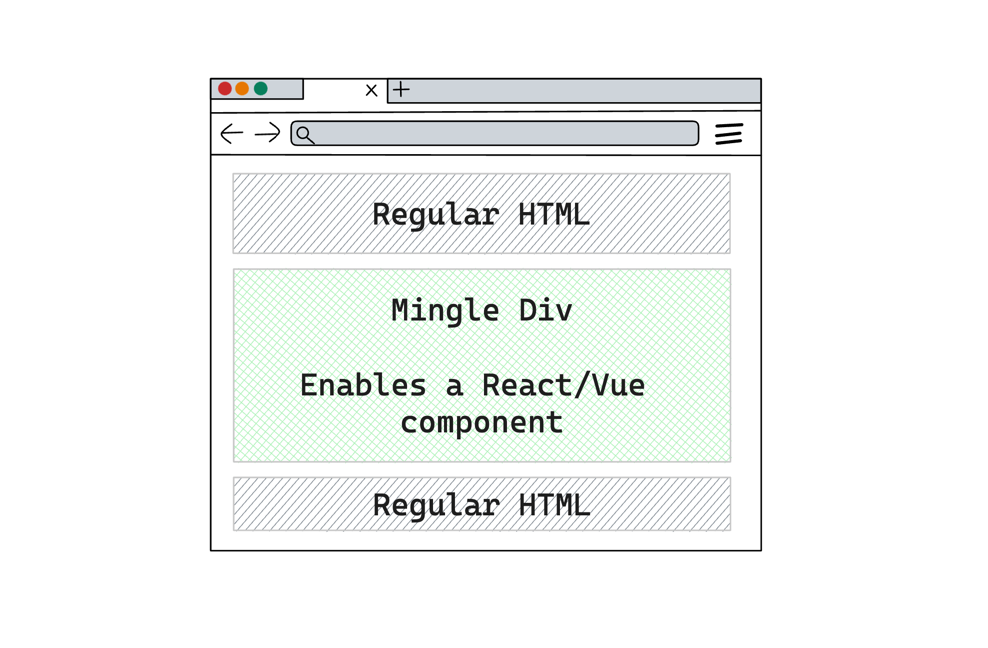
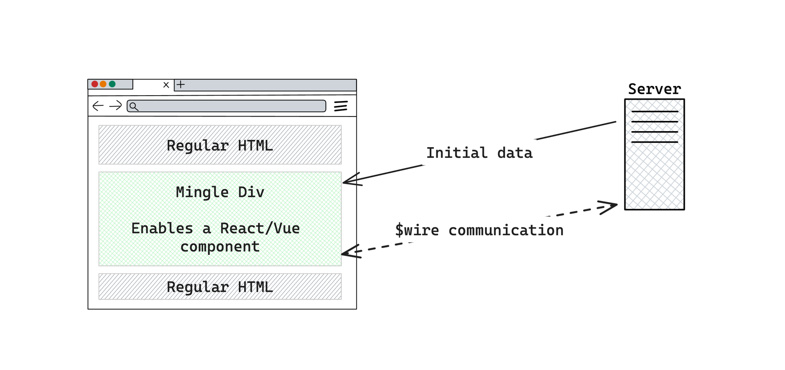

# What is MingleJS?

As you may already know, Livewire is a full-stack framework for Laravel that allows you to build dynamic interfaces using server-side code.
MingleJS allows you to use React/Vue components in your Livewire application, so you can use the best of both worlds.

## How is it working?

MingleJS renders a `div` on the server-side, and then mounts the React/Vue component on the client-side. Each JS component is rendered by a Livewire compoenent, so you get an island of interactivity in your Livewire application, with the JS of your taste.

## Some included nicety features

In the backend component, you can pass data that the component will have access to on the frontend.

In addition, you get the server-side communcation of Livewire, meaning you get to make server requests just by `$wire.addTodo(todo)`. We'll get to that later. Find below a simple diagram of how MingleJS works in a page.

## How do I use it?

All you have to do is a regular Livewire component, with a little twist, so it can render JavaScript. Don't worry, there's a friendly command to create components for you. Find how to install and use MingleJS in the [Getting Started](/getting-started) page or jump right into the [Quickstart](/quickstart) page.

